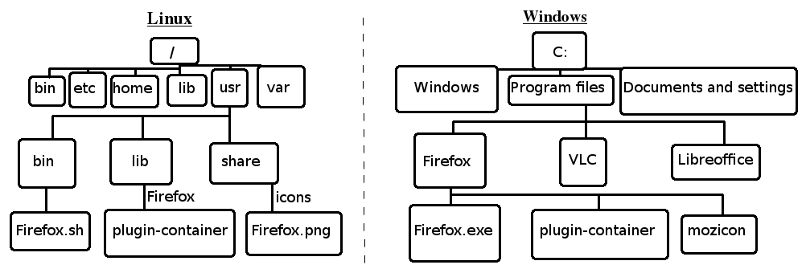
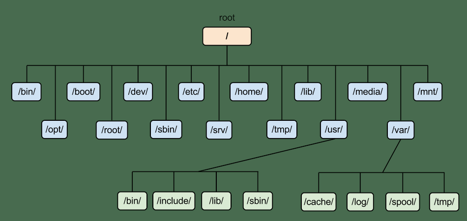

# Linux Guide

# What is Unix?
Unix comes before linux, so if you know a little bit, it will be great for you. Unix is an operating system whose development started in 1969 for multi-user, multi-tasking. Unix is not free and open source os. It can be only utilized by its copywriters. So linux came into the picture.
E.g: SunOS, Solaris, SCO Unix, HP/UX.

# What is Linux?

To understand simply, like Windows, Mac, Linux is an operating system \[OS\] based on Linux Kernel. Operating systems lie between computer hardware and computer users, so that users can interact with computers easily.  It was developed by Linus Torvalds in 1991.

It is free and open source means you can use it for free, view its source code. We can change the source code of linux and use it for personal as well as commercial purposes.

E.g: Ubuntu, Arch Linux, Debian GNU etc.

# Where is linux?
- TV,
- Mobile Phones.
- Self Driving Car.
- Plane.
- Rocket.
- Many websites are hosted on Linux.

# Who Uses Linux?
- US Government 
- Top Tech Companies like Google, Microsoft, Amazon by various means.
- Hackers.
- Financial Institutes.
- Computer Programmers and Researchers.
- Those who want to acquire high technical knowledge.

# Some Linux Distro:
- Ubuntu
- Fedora
- Elementory OS
- Red Hat OS
- Cent OS
- Kali Linux
- Arch Linux

# Linux Vs Windows
- Linux is Free But Windows is Paid.
- Linux runs for months or years without reboot, but in windows often reboot is required.
- Most of the software is available for windows but not in linux. 
- Linux is Secure than windows.
- Linux is Fully Customizable but Windows is not.

# Points to Remember
- Folder in linux called directory.
- Linux is a case sensitive System. A is different than a.
- Avoid using filename as space.
- Super Admin is also called root who can do anything.
- Software is called a package.

# Are all linux based OS free?
No, not all linux based OS are free. Enterprise level linux based operating systems are paid. E.g Red Hat is a paid OS, if we have a problem the Red Hat team will support and provide us a solution.

# Basic Tour Of Ubuntu
Background Change, Datetime Settings, Wifi, Bluetooth etc.

## File System: Windows VS Linux

## Linux File Hierarchy Standard (LFHS)

| Path     | Content                             |
| -------- | ----------------------------------- |
| `/bin`   | Binaries (User)                     |
| `/root`  | Files of root user 		                     |
| `/boot`  | Static boot loader files            |
| `/etc`   | Host specific configs               |
| `/lib`   | Shared libraries and kernel modules |
| `/sbin`  | Binaries (System/root)              |
| `/var`   | Varying files (e.g. Logs)           |
| `/usr`   | 3rd party software                  |
| `/proc`  | Pseudo file system                  |
| `/sys`   | Pseudo file system                  |
| `/mnt`   | Mountpoint for internal drives      |
| `/media` | Mountpoint for external drives      |
| `/home`  | User homes                          |
| `/run`   | PID files of running processes      |

### Linux file system in a image

---

# Everyday Commands
*note: There exists a man(manual) page for almost all commands you use. IF you are curious to know more about commands you can simply type `man command` and see it's details and usage description*
*For Example: To know about `ls` command, write `man ls` in terminal and press enter. After finishing reading manuals press `q` to exit man pages.* 

**Basic Commands**

| Command 	 | Description                                       |
| ---------- | ------------------------------------------------- |
| `whoami`	 | Print current user name                           |
| `hostname` | Print current host name                           |
| `date`	 | Print current date and time 						 |
| `clear` 	 | Clear Screen (Clear contents in currently open terminal emulator) |
| `users`	 | Print Currently logged in user/s 				 |
| `reboot`	 | Restart your machine 							 |
| `poweroff` | Shut down your machine 							 |
| `sudo`	 | Gives super user permission to your commands (similar to administrator in windows)  |

---

**File System Commands**

| Command | Options          | Description                                       |
| ------- | ---------------- | ------------------------------------------------- |
| `cd`    | `-`              | Navigate to last dir                              |
| `cd`	  | `path to directory` | Navigate to the directory given by path 		 | 
|         | `~`              | Navigate to home                                  |
|         | `~username`      | Navigate to home of specified user                |
|		  | `..` 			 | Nagivate one directory backward 					 |
|		  | `../..` 		 | Nagivate two directory backward 					 |
| `pwd`   |                  | Print working dir                                 |
| `ls`    |                  | Print dir content                                 |
|         | `-l`             | Format as list                                    |
|         | `-a`             | Show hidden items (`-A` without `.` and `..`)     |
|         | `-r`             | Invert order                                      |
|         | `-R`             | Recurse                                           |
|         | `-S`             | Sort by size                                      |
|         | `-t`             | Sort by date modified                             |
| `mkdir` | `dirname`        | Create dir 			                             |
| `mkdir` | `-p`             | Create dir with parents                           |
| `cp`	  |	`sourcefile destination` | Copy file from source to destination 	 |
| `cp`    | `-r`             | Copy dir                                          |
| `mv`    | `sourcefile destination` | Move recursively (source to destination)	 |
| `rmdir` | `-p`             | Remove dir and empty parents                      |
| `rm`    | `file`           | Remove file |
|		  | `-rf`            | Remove dir recursively, `-f` without confirmation |
|		  | `ch*` 			 | Remove all files starting from ch 				 |
|		  | `*.jpg` 		 | Remove all .jpg files 				 			 |
| `find`  | `-iname pattern` | Search dir/file case-insensitive                  |
|         | `-mmin n`        | Last modified n minutes ago                       |
|         | `-mtime n`       | Last modified n days ago                          |
|         | `-regex pattern` | Path matches pattern                              |
|         | `-size n[kMG]`   | By file size (`-n` less than; `+n` greater than)  |
|         | `! searchparams` | Invert search                                     |
| `locate`| `file` 			 | find your file by name(faster than find) (Must run `sudo updatedb` before using this command) |

---

**File Manipulation**

| Command | Options 		| 		Description 								 |
| ------- | --------------- | -------------------------------------------------- |
| `echo`  |`"TEXT TO PRINT"`| Displays the content inside Inverted commas ("")	 |
| 		  |`"TEXT" >> file` | Write/append `TEXT` inside `file`					 |
| 		  |`"TEXT" > file`  | Write/Overwrite `TEXT` inside `file`				 |
| `touch` |	`file`			| create a file										 |
| `touch` |	`ch{1..9}.txt`	| Create files from ch1.txt to ch9.txt	 			 |
| `cat`   | `file` 			| Print content                              		 |
| `tac`   | `file` 			| Print content inverted							 |
| `sort`  | `file` 			| Print sorted										 |
|         | `file -r -u` 	| Print sorted descending without dublicates		 |
| `uniq`  | `file` 			| Hide consecutive identical lines 					 |
| `wc`    | `file` 			| Count Lines, Words, Chars (Bytes) 				 |	
|		  |	`-l`			| Count Lines in files 								 |
|		  |	`-w`			| Count Words in files								 |
|		  |	`-c`			| Count Characters in files							 |

---

## Stream redirection

- `>` overwrite
- `>>` append

*For examples:*
| Command 							  | Description		 							   |
| ----------------------------------- | ---------------------------------------------- |
| `echo "I LOVE LINUX" > lln.txt` 	  | creates lln.txt if it doesn't exist and writes `I LOVE LINUX` inside lln.txt; if lln.txt exists already, overwrites the content inside it with `I LOVE LINUX` |
| `echo "LINUX IN NEPALI" >> lin.txt` | creates lin.txt if it doesn't exist and writes `I LOVE LINUX` inside lln.txt; if lin.txt exists already, it appends `LINUX IN NEPALI` to a new line without overwrithing/erasing the previous contents in the file |

